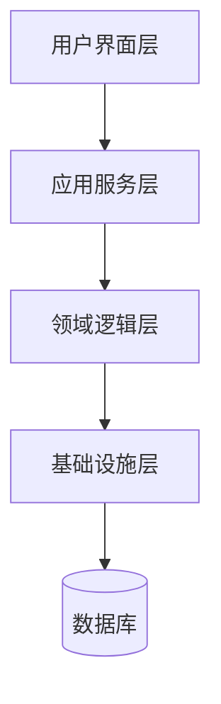
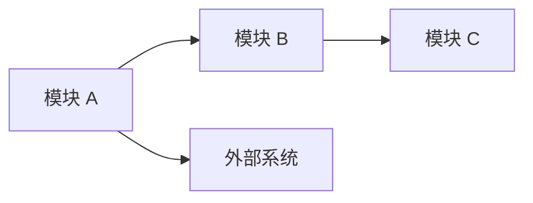
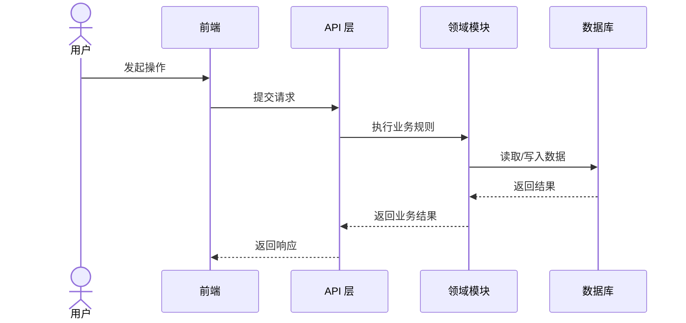

# 架构设计

本文件用于指导架构设计。当设计任务涉及系统分层、模块关系、技术选型、边界、演进策略时加载。

## 适用场景

- 新项目需要确定整体技术架构、模块划分或系统边界。
- 旧项目需要在现有架构上补齐能力，而不是直接进入实现。
- 一个需求会影响多个模块、服务、包、页面或数据流。
- 需要判断某个功能应该放在哪个模块、通过什么接口协作。
- 需要比较多种架构方案，并明确取舍。
- 需要记录难以逆转、影响面大的技术决策。

## 输入检查

进入架构设计前，先确认以下输入是否可用：

- 用户或 clarify 阶段提供的目标和范围。
- 已有产品设计、UI/UX 设计或前端设计结论。
- 现有 `docs/` 中相关架构说明、ADR、规格文档。
- 旧项目中的目录结构、技术栈、模块划分和主要依赖。
- 新项目中的约束条件，例如目标平台、团队熟悉度、部署方式、性能或合规要求。

如果输入不足以判断边界或技术约束，先提出缺口，不要凭空指定架构。

## 架构设计关注点

### 新项目还是旧项目

新项目和旧项目的架构设计方式不同。

新项目应关注：

- 当前推荐技术栈是否可靠、活跃、适合长期维护。
- 团队是否能掌握这套架构。
- 初始架构是否足够简单，不为未来幻想过度设计。
- 是否为后续扩展留下清晰边界，但不提前实现复杂机制。

旧项目应关注：

- 当前架构的真实状态，而不是理想状态。
- 已有模块边界是否还能承载新需求。
- 是否存在重复、浅层封装、概念泄漏或跨层调用。
- 能否通过小步补齐解决，而不是推翻重写。
- 如果必须迁移，迁移路径、兼容策略和风险是什么。

### 模块边界

架构设计要明确模块边界。

一个模块不是文件夹名字，而是具有相对稳定接口和内部实现的单元。模块可以是：

- 一个业务域。
- 一个包或子系统。
- 一个前端功能区。
- 一个后端服务。
- 一个独立能力，例如鉴权、计费、通知、搜索。

好的模块边界应满足：

- 调用方只需要知道接口，不需要理解内部细节。
- 改动集中在模块内部，不会扩散到大量调用方。
- 模块名称来自业务概念或稳定技术职责，而不是临时实现细节。
- 模块能被独立理解、测试和替换。

### 接口与实现

架构设计需要区分接口和实现。

接口不只是函数签名，还包括：

- 输入和输出。
- 调用顺序。
- 错误模式。
- 幂等性。
- 状态变化。
- 约束和不变量。
- 调用方需要知道的配置和依赖。

实现是接口背后的内部细节。设计文档应明确哪些内容属于接口承诺，哪些只是当前实现方式。

### 深模块与浅模块

优先设计深模块，而不是浅封装。

深模块：小而稳定的接口背后隐藏大量复杂性。
浅模块：接口几乎和实现一样复杂，调用方仍然要理解大量内部细节。

可以用删除测试判断模块是否有价值：

- 如果删除这个模块后，复杂度只是平均散落到多个调用方，它原本在提供价值。
- 如果删除这个模块后，复杂度基本消失，它可能只是无意义的 pass-through。

### seam 与 adapter

当架构需要隔离变化、外部依赖或跨系统协作时，需要设计 seam。

seam 是行为可以被替换的位置。adapter 是 seam 后面的具体实现。

设计 seam 时要避免无意义抽象：

- 只有一个 adapter 时，seam 通常只是猜测出来的抽象。
- 至少存在两个真实 adapter（例如生产实现和测试实现）时，seam 才更可能有价值。
- 不要把内部测试 seam 暴露成公共接口。

常见依赖类型：

- **进程内依赖**：纯计算、内存状态，无 I/O，可以直接合并进深模块。
- **本地可替代依赖**：数据库、本地文件系统等，如果有可靠本地替身，可在测试中使用替身。
- **远程但自有依赖**：内部服务或微服务，适合通过 port 和 adapter 隔离传输细节。
- **真实外部依赖**：第三方服务，需要清晰封装错误、重试、超时和契约变化。

### 数据流与控制流

架构设计要说明关键数据如何流动、控制权如何转移。

至少说明：

- 用户动作或外部事件从哪里进入系统。
- 哪些模块参与处理。
- 数据在哪里转换、验证、持久化或发送。
- 哪些步骤是同步的，哪些步骤是异步的。
- 失败时控制权如何返回或补偿。

### 技术选型

技术选型应服务于约束，不应为了流行或熟悉而选择。

记录选型时说明：

- 选择什么。
- 为什么适合当前约束。
- 不选哪些常见替代方案。
- 成本和风险是什么。
- 什么条件变化时需要重新评估。

新项目要确认技术资料没有过时。旧项目要优先沿用已有栈，除非已有栈无法支撑需求。

### 演进策略

架构设计不只描述目标状态，也要描述如何到达。

旧项目尤其需要说明：

- 哪些部分保持不变。
- 哪些部分新增。
- 哪些部分逐步替换。
- 是否需要兼容旧接口或旧数据。
- 是否需要灰度、迁移、回滚或双写。

## 工作方式

### 先理解现状

旧项目中，不要直接提出新架构。先阅读现有代码结构、文档和 ADR，理解当前架构为什么是这样。

如果现状和用户口述不一致，指出差异，让用户确认以哪个为准。

### 先定边界，再定细节

不要一开始就进入框架、库、接口字段或数据库表。

优先顺序是：

1. 业务能力边界。
2. 模块职责。
3. 模块协作关系。
4. 接口承诺。
5. 技术实现选择。

### 多方案对比要有真实差异

只有存在真实权衡时才写多方案。

好的方案对比应围绕：

- 简单性。
- 扩展性。
- 局部性。
- 测试方式。
- 迁移成本。
- 团队理解成本。

不要制造表面差异，例如“方案 A 用服务，方案 B 用模块”但职责和代价完全一样。

### 图优先表达

架构设计应使用图帮助表达结构关系。文字负责解释原因和取舍，图负责展示边界、层次和流向。

优先使用 Mermaid，因为它能直接保存在 Markdown 中，便于后续维护。

常用图类型：

- `flowchart`：系统分层、模块关系、数据流。
- `sequenceDiagram`：跨模块调用流程、同步/异步交互。
- `stateDiagram-v2`：状态流转较复杂时使用。
- `erDiagram`：当架构讨论涉及核心实体关系时使用。

不要为了画图而画图。每张图都应回答一个明确问题：

- 系统分成哪些层？
- 哪些模块依赖哪些模块？
- 用户动作如何穿过系统？
- 哪些外部系统在边界之外？
- 哪些流程是同步的，哪些是异步的？

### 不把实现计划写成架构设计

架构设计说明结构和决策，不是任务列表。

不要写：

- 第一步改哪个文件。
- 第二步写哪个函数。
- 第三步跑哪个测试。

这些属于版本规划或任务执行。

## 输出结构

```markdown
# [架构设计标题]

## 背景

当前需求、现状和架构约束。

## 目标

本次架构设计要达成的结果。

## 非目标

明确不处理的架构问题或不做的扩展。

## 当前状态

适用于旧项目。描述当前技术栈、模块结构、关键依赖和已知问题。

## 架构方案

描述推荐架构，包括系统分层、模块边界、协作关系和数据流。

## 架构图

至少提供能说明核心结构的 Mermaid 图。根据设计内容选择需要的图，不必每次都画全。

### 系统分层图



### 模块关系图



### 关键流程图



## 模块设计

### [模块名称]

- 职责：
- 对外接口承诺：
- 内部实现边界：
- 依赖：
- 测试方式：

## 关键决策

### [决策名称]

- 决策：
- 原因：
- 替代方案：
- 取舍：

## 数据流 / 控制流

描述关键流程如何穿过各模块。

## 技术选型

- 选择：
- 原因：
- 不选：
- 风险：

## 演进策略

适用于旧项目或迁移场景。说明新增、保留、替换、兼容、回滚等策略。

## 风险与开放问题

- 已知风险。
- 尚未决策的问题。
```

## 质量检查

完成架构设计后，检查：

- 是否明确了新项目或旧项目语境。
- 是否说明了现有约束，而不是凭空设计。
- 是否有清晰模块边界。
- 是否区分接口承诺和内部实现。
- 是否避免了无意义抽象和浅层封装。
- 是否说明关键依赖如何处理。
- 是否记录了重要取舍，而不是只给结论。
- 是否包含必要的 Mermaid 图来表达层次、模块关系或关键流程。
- 是否避免写成任务清单或实现步骤。
